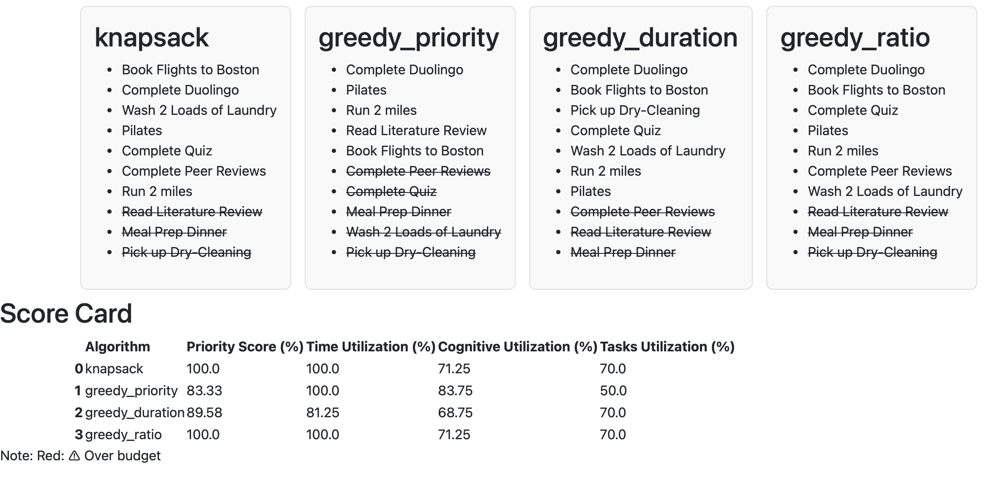

# Dual-Constraint Task Optimization: Comparing Dynamic Programming and Greedy Approaches

## Project Overview
When one is building a to-do list, users manually decide the order in which tasks are completed, typically mirroring 
a greedy approach. Most productivity tools with to-do lists adds a layer of functionality which allow tasks to be 
labeled by priority, yet the ordering of the task is still left to the user. The idea though is that if a task is 
flagged as a priority, it should be completed before the other tasks, and the primary constraint utilized here is time. 

Yet this does not account for other factors, such as cognitive load which could affect how many tasks you can complete
despite the time the user may have allotted or the number of tasks they wanted to complete.

This project will attempt to model task selection as an optimization problem in which both time and cognitive load are 
treated as constraints. Although the order of task selection is affected by many factors, the goal is to implement a 
dynamic programming solution and compare it to the baseline greedy approaches in order to evaluate whether the 
proposed system produces meaningfully different task selections.

### Research Question
*When both time and cognitive capacity are constrained, how does dynamic programming compare to greedy task-selection?*

### Algorithm
Dynamic Programming: 0/1 Knapsack 

### Expected Data and Outputs
**Input:** Two curated datasets are provided in `data/`:
- `real_todo_list.csv` - real to-do list used as primary example
- `divergence_todo_list.csv` - designed to demonstrate knapsack vs greedy ratio divergence

Synthetic datasets can be generated via `--generate` flag. See Usage and Options.

**Output:** An HTML file summarizing task selection produced by the 0/1 knapsack algorithm and 
three greedy variations, alongside a normalized scorecard for cross-algorithm comparison.

## Installation / Setup
**Requirements:** Python 3.14

1. Clone the repository
```bash
git clone https://github.com/tera90223/task_optimization_dp.git
```
2. Switch to projectDP_PR branch
```bash
git checkout projectDP_PR
```
3. Move into project directory
```bash
cd task_optimization_dp
```
4. Create a virtual environment:
```bash
python -m venv .venv
source .venv/bin/activate # Mac/Linux
.venv\Scripts\activate    # Windows
```
5. Install dependencies:
```bash
pip install -r requirements.txt
```

## Quick Start
```bash
cd src
python main.py --csv '../data/real_todo_list.csv' --time_budget 240 --cog_budget 80
```

Inputs
 * --csv: File Path to a CSV file
    * This is the default to do list with 10 tasks based on one of my own. 
This can be found in the `data\` directory.
 * -- time-budget: The total time budget for all tasks in minutes
    * Default is 240 minutes or 4 hours
 * -- cognitive-budget: The total cognitive capacity to all tasks (ranges 1-100)
    * Default is 80 

Output
    Output is an html file found in `output/results.html`



## Usage and Options
Run `python main.py -h` for full argument descriptions. Common usage patterns: 

* Use Existing CSV files
```bash
python main.py --csv '../data/divergence_todo_list.csv' --time_budget 240 --cog_budget 80
```
* Generate Synthetic Data
```bash
python main.py --generate --n 100 --choice "high correlation" --seed 42 --time_budget 240 --cog_budget 100
```
* Generate and Save Synthetic Data
```bash
python main.py --generate --n 100 --choice "high correlation" --seed 42 --save --time_budget 240 --cog_budget 100 
```

## Limitations and Assumptions
User input can be only be a CSV file with the following columns:

|     Columns     |        Description         | Data type |
|:---------------:|:--------------------------:| :--: |
|    task_name    |     Name of task     | str |
|    duration     |       Time (minutes)       | int |
|  cognitive_cost | Cognitive Capacity (1-100) | int | 
| priority  |  Priority of Task (1-10)   | int |

* This is a proof of concept and not a prototype. There is not a benchmark so most of the discussion found in the notebook 
may be subjective. 
* By design, Greedy does not account for cognitive load based on real-world behavior, which does mean the greedy
algorithms can exceed cognitive capacity.
* This is based on real-world examples of to-do list, so we are to assume that the number of tasks in one to-do list 
will not exceed 100 tasks.
* Tasks are independent of one another although in the real-world some tasks can increase productivity and cognitve load.
* Cognitive load is self-reported and does not generalize across users
* Time and Capacity budgets do not change at runtime and does not adapt as tasks are completed. 
